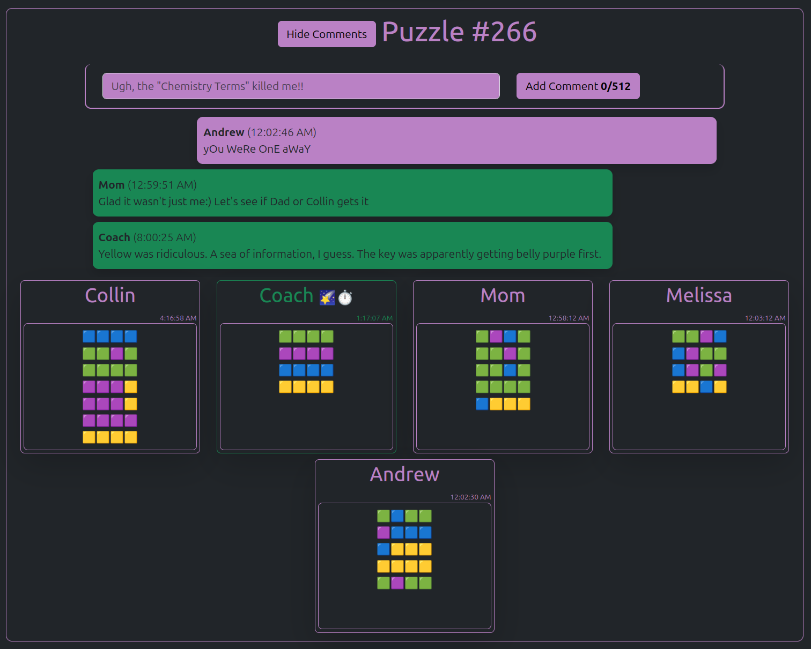
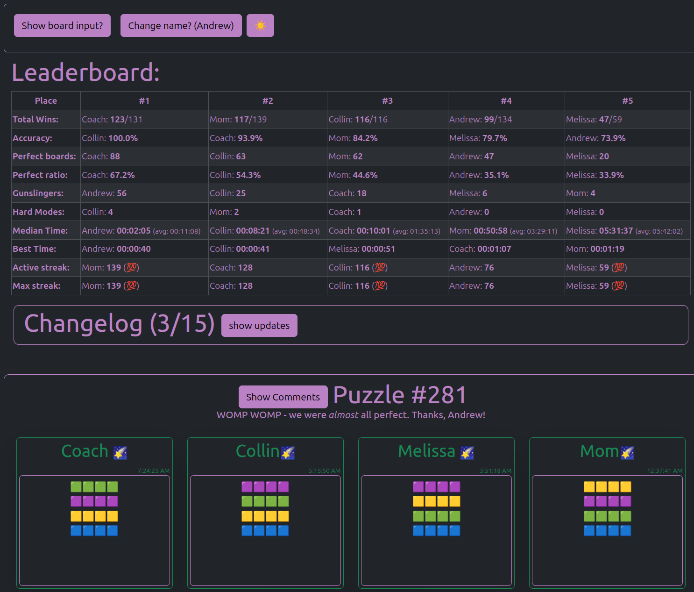
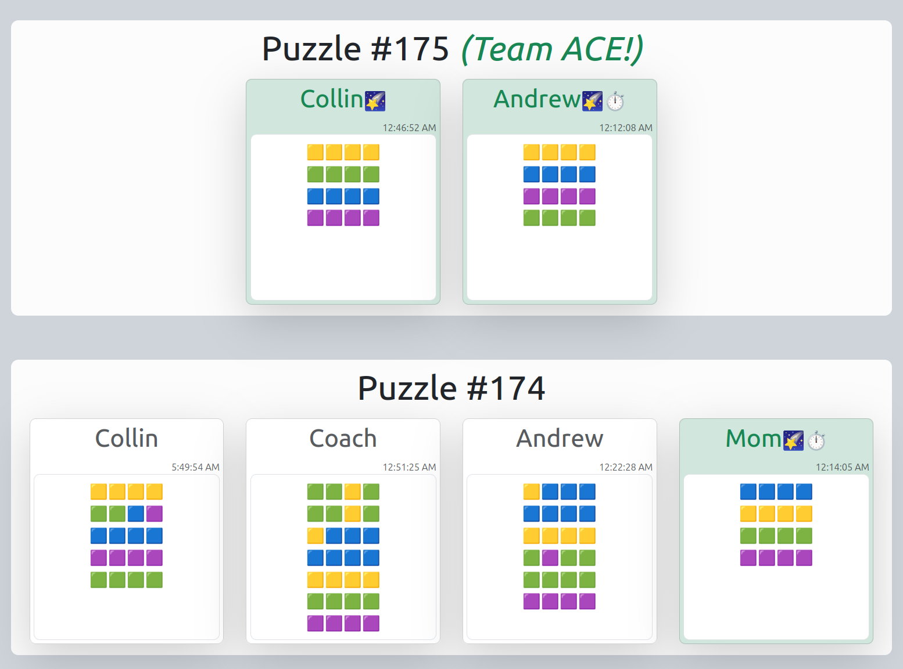
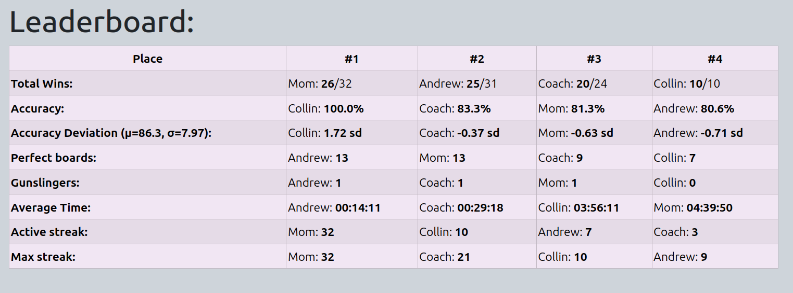
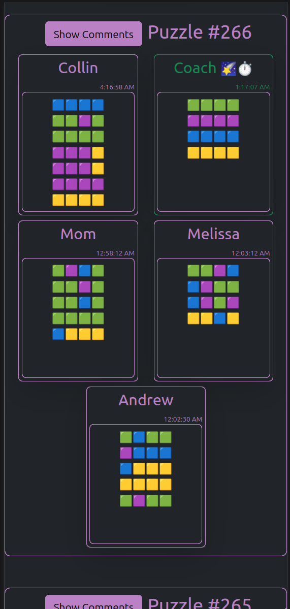
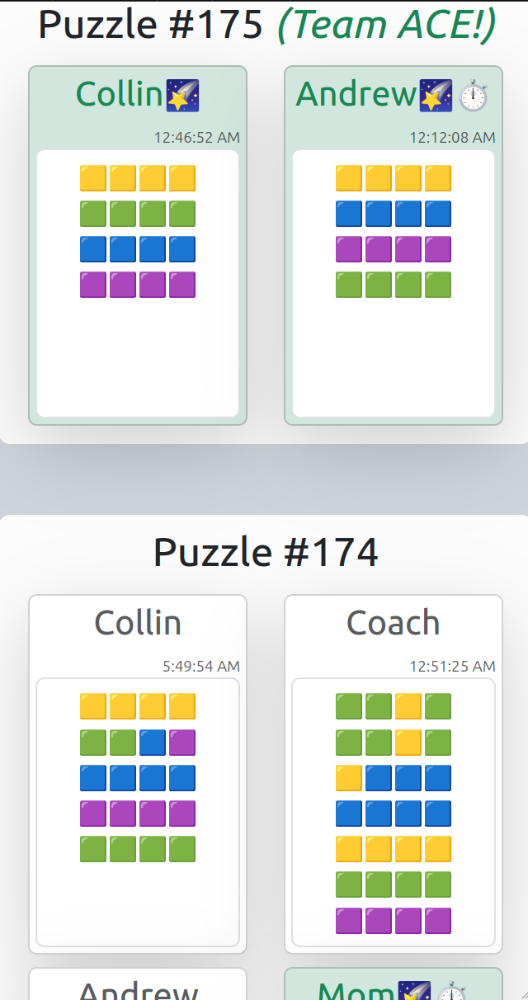
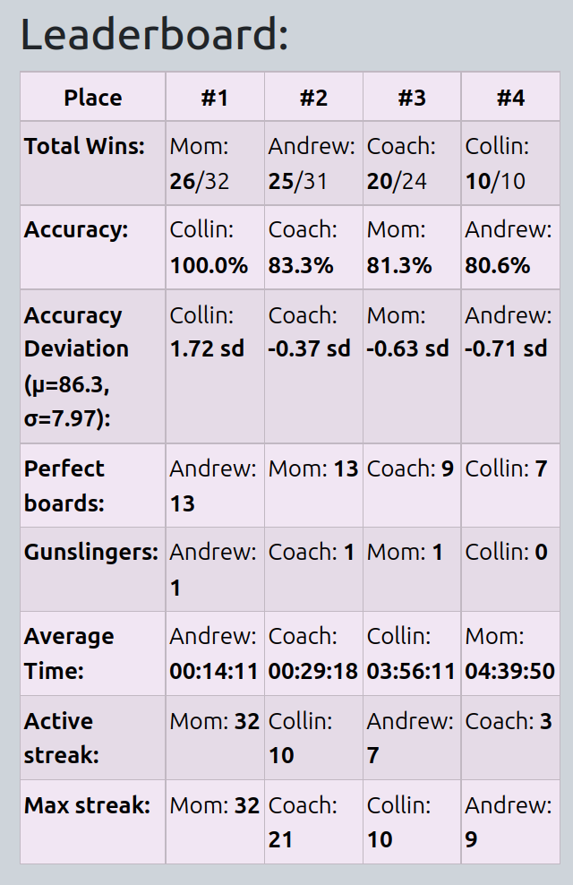

# Connections!

### Purpose

This application is built for keeping track of my family's scoreboards for the [NYT's 'Connections' game](https://www.nytimes.com/games/connections), storing a long history of each individual player's board and providing analytical statistics and leaderboards for various performance metrics.

Some of the metrics include finding total wins, each player's winning accuracy, calculating the mean and standard deviation of the cumulative playerbase accuracy, calculating each individual player's standard deviations, amount of perfect boards, amount of times to be the first respondent, the average time it takes to play, amount of days actively played, and the overall max streak of amount of days actively played.

To keep everything as streamlined as possible for my non-tech-adjacent family, user input is taken directly from the copy-pasted output from the New York Times and parsed and sanitized to strip and organize the data.

Below are some screenshots showing a brief overview of the functionality.

### Desktop screenshots

  
A puzzle with comments (featuring dark mode)

  
Leaderboard metrics (dark mode)

Submissions from multiple days of boards

Leaderboard metrics

### Mobile screenshots

  
Responsive board (dark mode)

Submissions from multiple days of boards

Leaderboard metrics

 
 

# Tech Details

### Stack

##### Client

Just a good bit of Typescript & React. This was initially meant more as a PoC, so styling is just some quick and dirty Bootstrap.

##### Server

The server is a pretty minimalist Typescript+Node express server. For the persistent data, all data is stored long-term via MySQL, but there is a Redis cache serving the data to optimize response time. Upon a new board being created, the cache is updated.

### Roadmap

##### Styling

I'll likely be migrating the UI to using Tailwind or DIYing it with Styled Components.

##### Operations/interactivity

A major downstream plan is instead of having this one singular board instance, is to allow the creation of multiple shared instances so that I can make this app available for public usage.
